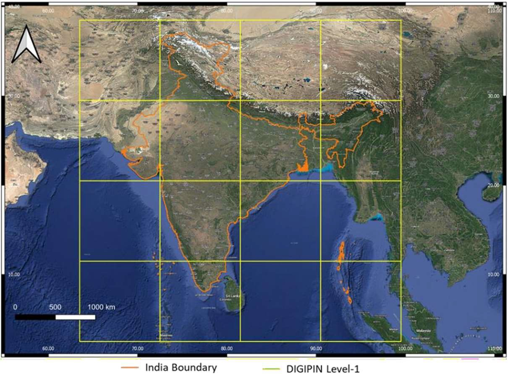
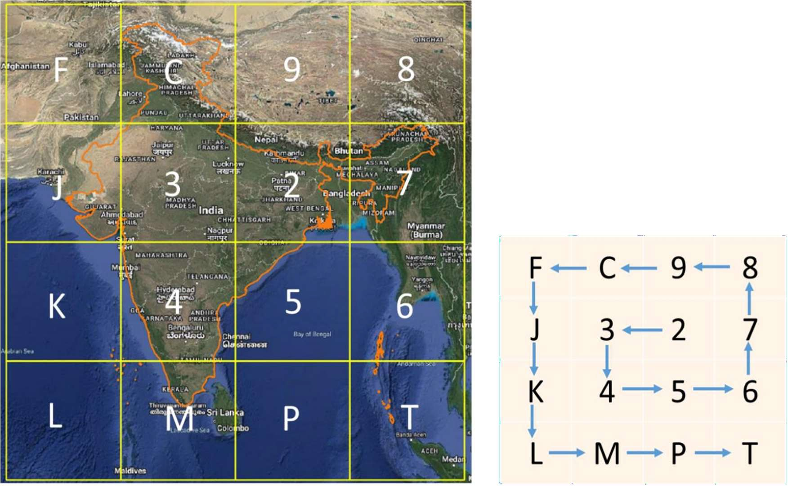
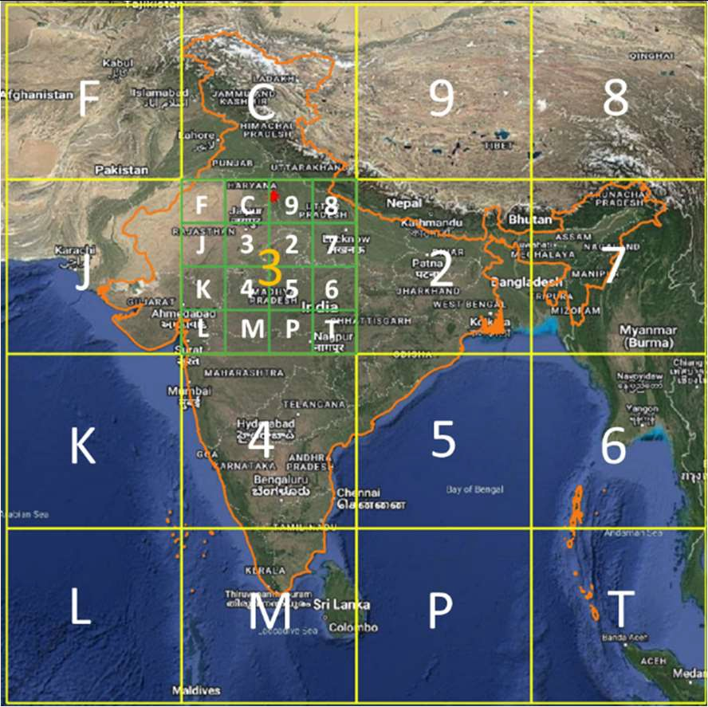
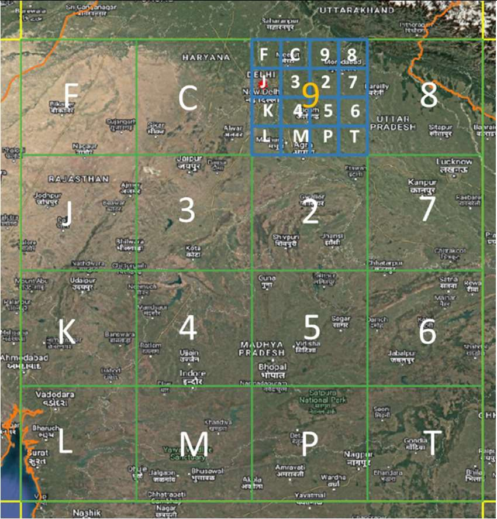
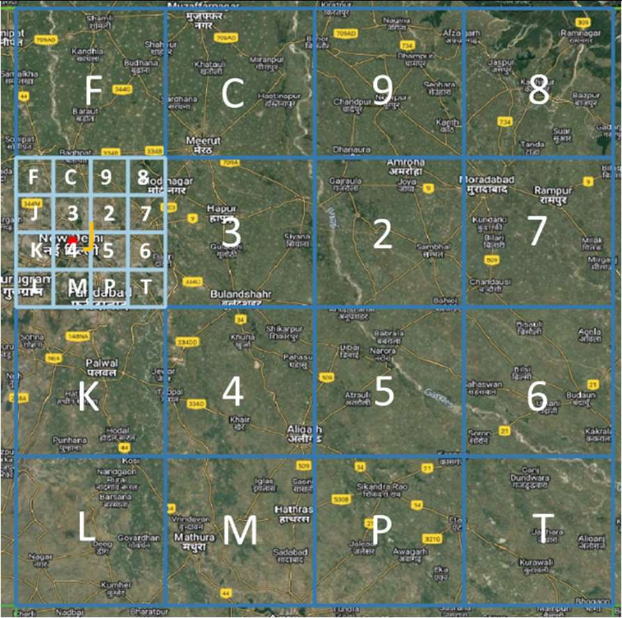
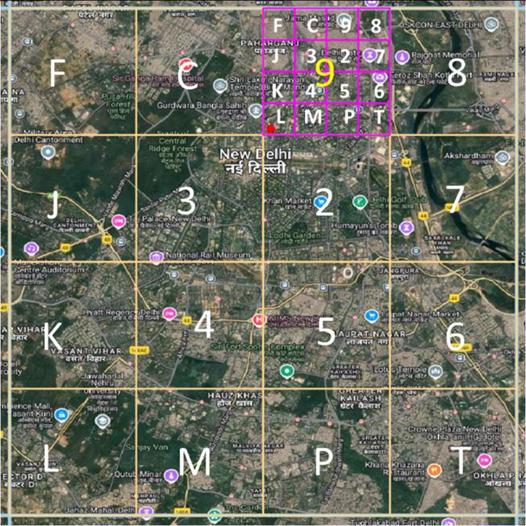
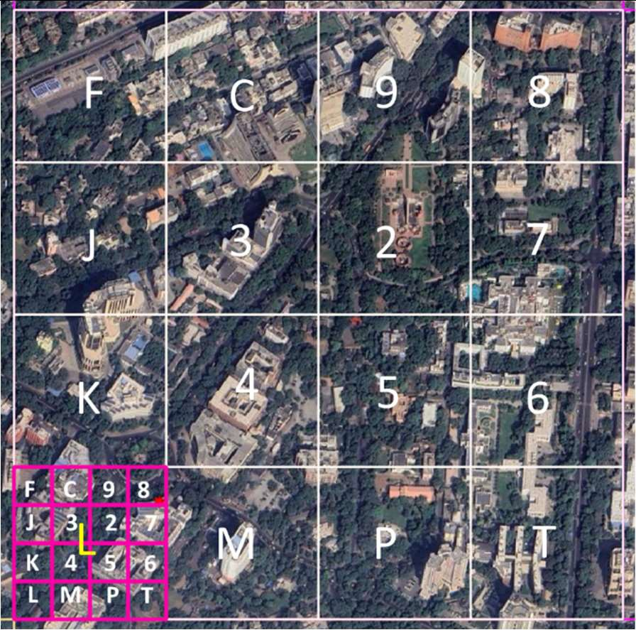
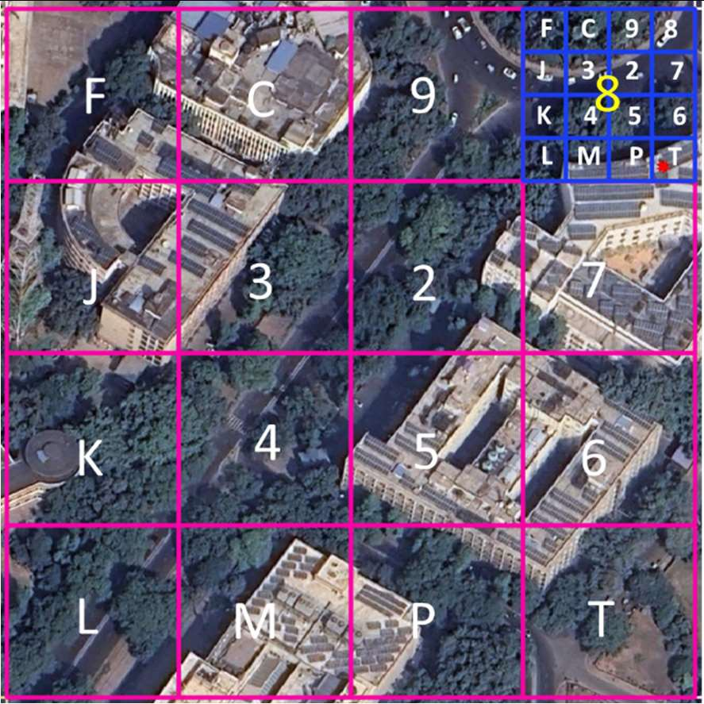
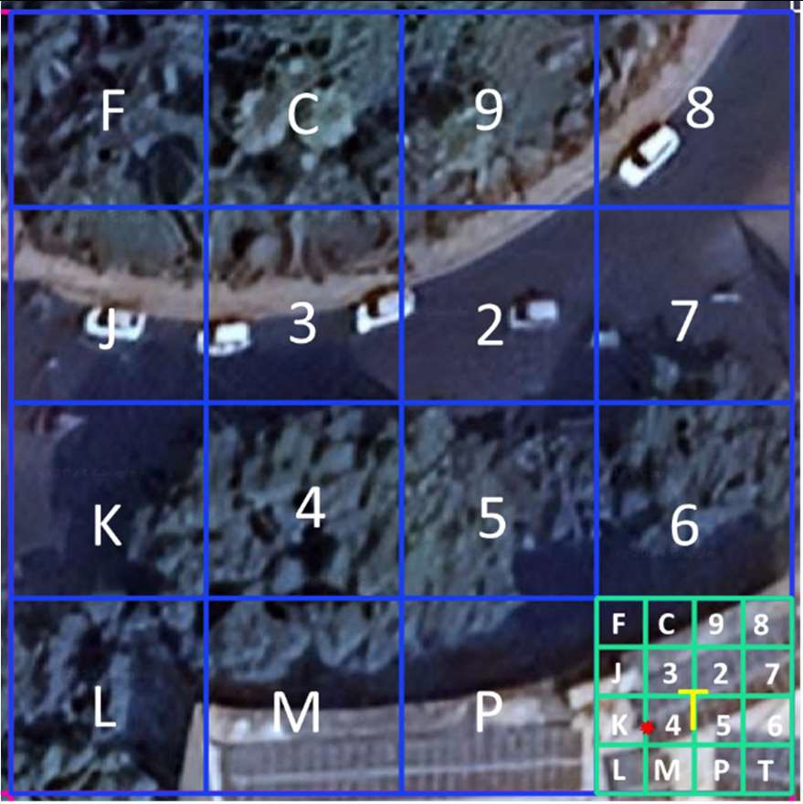
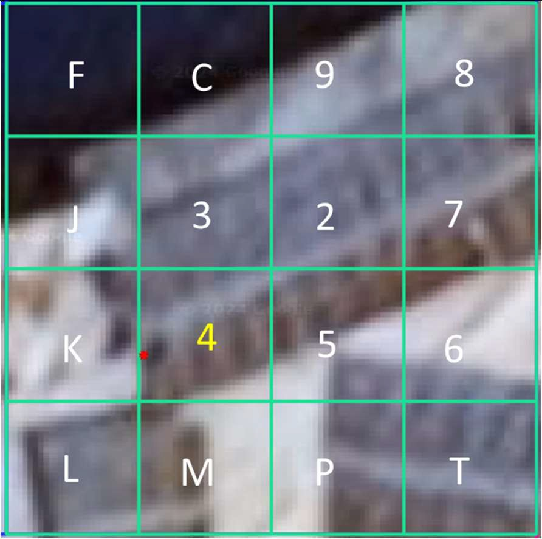

# Digital Postal Index Number (DIGIPIN)
## National Level Addressing Grid

### Technical Document – Final version

#### Ministry of Communications Department of Posts

**March, 2025**

## 1. INTRODUCTION

The Department of Posts has undertaken an initiative to establish a Digital Public Infrastructure (DPI) for a standardized, geo-coded addressing system in India. As a part of this initiative, the Department is releasing final version of DIGIPIN – the foundation layer of the DPI. This initiative seeks to provide simplified addressing solutions for seamless delivery of public and private services and to enable "Address as a Service" (AaaS) across the country.

DIGIPIN is an open-source national level addressing grid developed by Department of Posts in collaboration with IIT Hyderabad and NRSC, ISRO and is a key component of the digital address ecosystem. The beta version of the technical document on DIGIPIN was placed for public comments and expert opinion.

After thorough analysis of the comments received through various stakeholder consultations, the Department has now finalized the DIGIPIN Grid that incorporates the relevant inputs. The DIGIPIN layer will serve as a uniform address referencing framework available both offline and online, enabling logical and precise location identification with directional attributes across India, offering significant advantages of ensuring precise geographic identification and thus complementing the conventional addressing system by providing an additional attribute. This would bridge the gap between physical locations and their digital representation.

Incorporating DIGIPIN as an additional address attribute enables the leveraging of GIS capabilities, laying the foundation for future GIS-based digitalization of service delivery across various organizations in a cost-effective manner. The DIGIPIN would enhance location accuracy across various sectors by providing precise geographic coordinates, ensuring accurate service delivery and reducing emergency response times. By integrating DIGIPIN, Banking Financial Services and Insurance sector can leverage the additional address attribute, DIGIPIN, to enhance accuracy and efficiency in their KYC processes. DIGIPIN can simplify address management thus enhancing citizen convenience.

A standardized geo-coded addressing system would enhance India's geo-spatial ecosystem. It would add to the geospatial knowledge stack of the country in line with the National Geospatial Policy 2022, which seeks to strengthen the geospatial sector to support national development, economic prosperity and a thriving information economy.

This document outlines the technical details of **DIGIPIN**, the National-Level Addressing Grid.

## 2. DESIGN APPROACH

### 2.1 Core Concept

The DIGIPIN layer is the cornerstone of the entire digital address ecosystem.

DIGIPIN is visualised as an alpha numeric offline grid system that divides the geographical territory of India into uniform 4-meter by 4-meter(approx.) units. Each of these 4m X 4m units (approx.) is assigned a unique 10-digit alphanumeric code, derived from the latitude and longitude coordinates of the unit. This alphanumeric code serves as the offline addressing reference for any specific location within the DIGIPIN system. DIGIPIN is thus strictly a function of the latitude and longitude of the location represented as a grid value. The system is designed to be scalable, adaptable, and integrated with existing GIS applications.

### 2.2 DIGIPIN layer

DIGIPIN layer will act as the addressing reference system which will be available offline and can be used for locating addresses in a logical manner with directional properties built into it due to the logical naming pattern followed in its construction. DIGIPIN Grid system being an addressing referencing system, can be used as the base stack for development of other ecosystems where addressing is one of the processes in the workflow. Since DIGIPIN solely represents a location and does not store any personal information, it respects privacy.

## 3. DIGIPIN : Code Architecture

The detailed structure is such that the DIGIPIN is essentially an encoding of the latitude and longitude of the address into a sequence of alphanumeric symbols using the following 16 symbols: 2, 3, 4, 5, 6, 7, 8, 9, C, J, K, L, M, P, F, T.

The process of identifying the cells is done in a hierarchical fashion. The encoding is performed at various levels, and the basic idea is the following:

* A bounding box is used that covers the entire country.

* The bounding box is split into 16 (i.e., 4x4) regions. Each region is labeled by one of symbols 2, 3, 4, 5, 6, 7, 8, 9, C, F, J, K, L, M, P, T. The first character in the code would identify one of these regions. This is called the *level-1* partition.

* Each region is then subdivided into 16 subregions in a similar fashion. Each of the 16 subregions are labeled by the 16 characters. For a given region, the subregion is identified by the second character of the code. Therefore, the first two characters of the code uniquely identify one of the 16^2=256 subregions. This is called the *level-2* partition.

* The encoding of successive characters, and therefore the next 8 levels is done in an identical fashion. The 10-symbol code therefore uniquely identifies one of the 16^10 cells within the bounding box.

### 3.1 Bounding box

Following are the details of the bounding box used:
 

*Figure 1: DIGIPIN level-1 grid lines (yellow) overlaid over the Indian region showing the extent of DIGIPIN bounding box*

* Longitude 63.5 – 99.5 degrees east
* Latitude 2.5 – 38.5 degrees north
* The Coordinate Reference System (CRS) used in the proposed code design is EPSG:4326. Using EPSG:4326 (WGS84 datum at epoch 2005) has several advantages like wide recognition and adoption, simplicity and global coverage.

The choice of the corner points of the bounding box are based on the following considerations:

* This includes the entire territory of India.

* Since the proposed extent has latitudinal and longitudinal extent of 36°, the final grid size after 10th iteration is a perfect square and has smaller size of 3.8m x 3.8m.

* This bounding box ensures alignment of DIGIPIN level-1 grid lines with Survey of India's 0.25° x 0.25° toposheets (topographical sheet numbering system), which are used for mapping at 1:50K scale

* Includes the maritime Exclusive Economic Zone (EEZ), and therefore DIGIPIN allows to provide addresses to Indian assets in the sea (oil rigs, future man-made islands, etc.), or even potentially be used to locate regions in the sea by the maritime sector. The maritime EEZ is computed assuming 200 nautical miles extent from the coastline.

* Level-1 grid lines do not cut through cities with very large population

* The level-10 cells would be almost rectangular, but the dimensions would vary based on the latitude. This would translate to a cell of size smaller than 3.8-meter x 3.8-meter if measured at the equator, and this is reasonable given the accuracy of most current commercially available Global Navigation Satellite System (GNSS).

### 3.2 Properties of DIGIPIN

* DIGIPIN contains the geographic location of the area. It is possible to extract the latitude and longitude of the address from the DIGIPIN with low complexity.

* DIGIPIN has been designed for the Indian context. All points of interest to India (including maritime regions) can be assigned codes, and it is possible to assign code even in areas that are very densely populated.

* The format of the DIGIPIN is intuitive and human-readable. Effort was made to infuse a sense of directionality within the format of DIGIPIN.

* DIGIPIN is independent of the land use pattern and the structure built. Note that DIGIPIN is designed as a permanent digital infrastructure, that does not change with changes in the names of state, city or locality, or with changes in the road network in an area. The DIGIPIN is designed to be robust to accommodate future developments and changes. The arrival of a new building in a community, or even a new village or city in a district, or changes in the name of a road or locality will not affect the underlying DIGIPIN.

* The length of the DIGIPIN is designed to be as small as possible in order to provide an efficient digital representation of addresses.

### 3.3 Labelling of regions at various levels

*Figure 2: Labelling of DIGIPIN level-1 grids (left) and 4x4 grid used for labelling (right)*

* In first iteration (level-1), the bounding box is divided into 16 regions using a 4x4 grid and each region is labelled using 16 symbols, 2, 3, 4, 5, 6, 7, 8, 9, C, F, J, K, L, M, P, and T, as shown in ***Figure 2***.

* A consistent gridding and labelling scheme is applied across all subsequent iterations (Levels 2 to 10). For these levels, the same labelled grid is utilized, with the labelling process carried out in a hierarchical manner.

* Each Level-1 region is further split into 16 sub-regions called Level-2 regions as illustrated in the ***Figure 3***. The regions are hierarchically partitioned into sub-regions in an identical fashion.

* Symbols are assigned in anticlockwise fashion, spiraling outwards. The grid provides some sense of directionality and adjacency cells labeled by consecutive symbols (such as 6 and 7) are geographical neighbors.
 

*Figure 3: Labelling of DIGIPIN level-2 grids (left) and 4x4 grid used for labelling (right)*

### 3.4 Assigning DIGIPIN to coordinates coinciding with DIGIPIN Grid Lines

In some of the cases, coordinates of a location may coincide with DIGIPIN grid lines. In such scenario, the location is assigned a DIGIPIN symbol of the adjoining right-side (eastward) grid, if it falls on a vertical (north-south) grid line. Similarly, a DIGIPIN symbol of adjoining up- side (northward) grid is assigned, if location coincides with a horizontal (east-west) grid line. The coordinates coinciding with DIGIPIN line intersection are assigned to adjoining top-right grid. The exception is made to coordinates coinciding with top-most (38.5° N) and right-most (99.5° E) grid lines wherein DIGIPIN symbols of the adjoining bottom-side (southward) grid and left- side (westward) grids are assigned, respectively.

### 3.5 Grid sizes at various levels

As explained above, the DIGIPIN generation is an iterative procedure. At level-1, the bounding box is divided into 16 (4x4) regions. The total latitudinal and longitudinal width of bounding box is 36°, resulting in 9° x 9° regions at level-1. Similarly, at level-2, each 9° x 9° region is further divided into 16 (4x4) sub-regions, resulting in 2.25° x 2.25° regions. The same process is carried out up to 10 levels. The table below shows a relation between the DIGIPIN code length, corresponding grid size and approximate linear distance at the equator. It gives an estimate of the positional uncertainty associated with DIGIPIN code length. For instance, a DIGIPIN code of length 6 represents a ~ 1km x 1km region. It requires an additional 4 digits to precisely locate a 3.8m x 3.8m region inside this region.

| Code Length | 1 | 2 | 3 | 4 | 5 | 6 | 7 | 8 | 9 | 10 |
|-------------|---|---|---|---|---|---|---|---|---|---|
| Grid Width | 9° | 2.25° | 33.75′ | 8.44′ | 2.11′ | 0.53′ | 0.13′ | 0.03′ | 0.5″ | 0.12″ |
| Approx. Distance | 1000 km | 250 km | 62.5 km | 15.6 km | 3.9 km | 1 km | 250 m | 60 m | 15 m | 3.8 m |

*Table 1: DIGIPIN grid size at different levels*

## 4. Key differences between Beta version and Final Version of DIGIPIN

* A modification in the extent of the DIGIPIN bounding box from 63.5° - 99°E & 1.5°- 39°N to 63.5°- 99.5°E & 2.5°- 38.5°N)

* The replacement of characters G, W, and X with C, F and T to maintain the phonetic and visual clarity of DIGIPIN, while maintaining the sequence of characters.

* A uniform gridding and labelling scheme across all iterations (1-10).

## 5. Illustration of DIGIPIN Generation Process

The ***figure 4*** illustrates the complete procedure for generating DIGIPIN for a specific location. For example, the geographical coordinates of Dak Bhawan (28.622788°N, 77.213033°E) are marked with a red star on the India base map. The figure demonstrates the selection of DIGIPIN symbols at each level, based on the grid encompassing Dak Bhawan. The DIGIPIN of Dak Bhawan is 39J 49L L8T4.

<table>
  <tr>
    <th align="center">Level-1</th>
    <th align="center">Level-2</th>
  </tr>
  <tr>
    <td>
      
    </td>
    <td>
      
    </td>
  </tr>
  <tr>
    <td align="center"><strong>3</strong></td>
    <td align="center"><strong>9</strong></td>
  </tr>
</table> 

<table>
  <tr>
    <th align="center">Level-3</th>
    <th align="center">Level-4</th>
  </tr>
  <tr>
    <td>
      
    </td>
    <td>
      
    </td>
  </tr>
  <tr>
    <td align="center"><strong>J</strong></td>
    <td align="center"><strong>4</strong></td>
  </tr>
</table> 

<table>
  <tr>
    <th align="center">Level-5</th>
    <th align="center">Level-6</th>
  </tr>
  <tr>
    <td>
      
    </td>
    <td>
      
    </td>
  </tr>
  <tr>
    <td align="center"><strong>9</strong></td>
    <td align="center"><strong>L</strong></td>
  </tr>
</table> 

<table>
  <tr>
    <th align="center">Level-7</th>
    <th align="center">Level-8</th>
  </tr>
  <tr>
    <td>
      
    </td>
    <td>
      
    </td>
  </tr>
  <tr>
    <td align="center"><strong>L</strong></td>
    <td align="center"><strong>8</strong></td>
  </tr>
</table>  

<table>
  <tr>
    <th align="center">Level-9</th>
    <th align="center">Level-10</th>
  </tr>
  <tr>
    <td>
      
    </td>
    <td>
      
    </td>
  </tr>
  <tr>
    <td align="center"><strong>T</strong></td>
    <td align="center"><strong>4</strong></td>
  </tr>
</table>   

*Figure 4: Illustration of procedure for deriving DIGIPIN of a known location*
